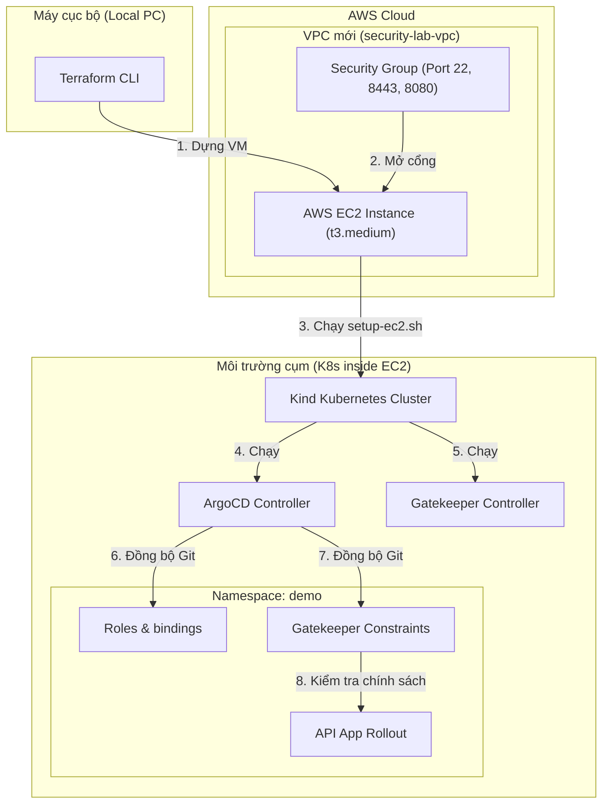

# Bản Đồ Đọc & Tìm Hiểu Dự Án (Code Reading Roadmap)

Dự án này là một Security Lab được thiết kế để triển khai trên AWS EC2 bằng Terraform, chạy trên Kubernetes (Kind) và đồng bộ qua GitOps (ArgoCD). Dưới đây là sơ đồ cấu trúc và lộ trình đọc code để bạn dễ dàng nắm bắt cách hoạt động.

---

## 1. Sơ đồ Kiến trúc & Luồng Dữ liệu (Architecture Flow)

Dưới đây là mô hình hoạt động của các thành phần trong Lab:

---

## 2. Thứ Tự Đọc Code Từng Bước (Sequential Reading Guide)

Hãy đọc các file trong dự án theo thứ tự logic dưới đây để hiểu luồng triển khai:

```mermaid
graph LR
    subgraph Hatang ["1. Hạ tầng"]
        direction TB
        F1["terraform/main.tf"]
        F2["setup-ec2.sh"]
        F3["EC2_GUIDE.md"]
    end
    subgraph GitOps ["2. GitOps Root"]
        direction TB
        F4["argocd/root.yaml"]
        F5["apps/app-common.yaml"]
        F6["apps/rbac.yaml"]
        F7["apps/gatekeeper.yaml"]
        F8["apps/gatekeeper-policies.yaml"]
    end
    subgraph RBACGroup ["3. RBAC"]
        direction TB
        F9["rbac/roles.yaml"]
        F10["rbac/rolebindings.yaml"]
    end
    subgraph GKGroup ["4. OPA Gatekeeper (Template -> Constraint)"]
        direction TB
        F11["k8sdisallowedtags"]
        F12["k8srequiredresources"]
        F13["k8sblockrootuser"]
        F14["k8shostnetwork"]
        F15["k8smaxreplicas"]
    end

    Hatang --> GitOps
    GitOps --> RBACGroup
    RBACGroup --> GKGroup
```

### Bước 1: Khởi tạo Hạ tầng (Infrastructure Setup)
1. **[terraform/main.tf](file:///d:/Workspace/Study/AWS/aws-sercurity/terraform/main.tf)**: Xem cách định nghĩa các tài nguyên AWS cơ bản (VPC, Subnet, Security Group chặn/mở cổng, EC2 instance và ổ cứng).
2. **[scripts/setup-ec2.sh](file:///d:/Workspace/Study/AWS/aws-sercurity/scripts/setup-ec2.sh)**: Script chạy trên EC2 để cấu hình môi trường K8s (cài đặt Docker, Kind, kubectl, Helm, và khởi động ArgoCD).
3. **[EC2_GUIDE.md](file:///d:/Workspace/Study/AWS/aws-sercurity/EC2_GUIDE.md)**: Hướng dẫn tích hợp từng dòng lệnh để deploy và destroy toàn bộ hạ tầng bằng Terraform.

### Bước 2: Khai báo GitOps & Root Application
4. **[argocd/root.yaml](file:///d:/Workspace/Study/AWS/aws-sercurity/argocd/root.yaml)**: Cấu hình ứng dụng Root để kích hoạt mô hình *App-of-Apps* (quét và quản lý toàn bộ thư mục `argocd/apps`).
5. **[argocd/apps/app-common.yaml](file:///d:/Workspace/Study/AWS/aws-sercurity/argocd/apps/app-common.yaml)**: Deploy các tài nguyên chung (tạo namespace `demo` ở sync-wave `-1` sớm nhất).
6. **[argocd/apps/rbac.yaml](file:///d:/Workspace/Study/AWS/aws-sercurity/argocd/apps/rbac.yaml)**: Khai báo ứng dụng đồng bộ cấu hình RBAC.
7. **[argocd/apps/gatekeeper.yaml](file:///d:/Workspace/Study/AWS/aws-sercurity/argocd/apps/gatekeeper.yaml)**: Deploy OPA Gatekeeper controller (sync-wave `-2` sớm nhất).
8. **[argocd/apps/gatekeeper-policies.yaml](file:///d:/Workspace/Study/AWS/aws-sercurity/argocd/apps/gatekeeper-policies.yaml)**: Deploy toàn bộ các mẫu chính sách bảo mật (ConstraintTemplates và Constraints).

### Bước 3: Phân quyền cụm (RBAC)
9. **[rbac/roles.yaml](file:///d:/Workspace/Study/AWS/aws-sercurity/rbac/roles.yaml)**: Xem định nghĩa quyền hạn (Developer, SRE, Viewer).
10. **[rbac/rolebindings.yaml](file:///d:/Workspace/Study/AWS/aws-sercurity/rbac/rolebindings.yaml)**: Cách gán (bind) vai trò cho 3 người dùng `alice`, `bob`, `carol`.

### Bước 4: Kiểm soát Chính sách (OPA Gatekeeper Rules)
*Mỗi luật gồm 2 file: File Template định nghĩa logic Rego và File Constraint xác định tham số và đối tượng áp dụng.*
* **Cấm tag `:latest`**: 
  - [k8sdisallowedtags-template.yaml](file:///d:/Workspace/Study/AWS/aws-sercurity/gatekeeper/templates/k8sdisallowedtags-template.yaml) (Rego)
  - [k8sdisallowedtags-constraint.yaml](file:///d:/Workspace/Study/AWS/aws-sercurity/gatekeeper/constraints/k8sdisallowedtags-constraint.yaml) (Chặn tag `:latest` trong namespace `demo`).
* **Bắt buộc resource limits**:
  - [k8srequiredresources-template.yaml](file:///d:/Workspace/Study/AWS/aws-sercurity/gatekeeper/templates/k8srequiredresources-template.yaml) (Rego)
  - [k8srequiredresources-constraint.yaml](file:///d:/Workspace/Study/AWS/aws-sercurity/gatekeeper/constraints/k8srequiredresources-constraint.yaml) (Yêu cầu `limits` CPU và Memory).
* **Cấm chạy Root**:
  - [k8sblockrootuser-template.yaml](file:///d:/Workspace/Study/AWS/aws-sercurity/gatekeeper/templates/k8sblockrootuser-template.yaml) (Rego)
  - [k8sblockrootuser-constraint.yaml](file:///d:/Workspace/Study/AWS/aws-sercurity/gatekeeper/constraints/k8sblockrootuser-constraint.yaml) (Cấm explicit `runAsUser: 0`).
* **Cấm HostNetwork**:
  - [k8shostnetwork-template.yaml](file:///d:/Workspace/Study/AWS/aws-sercurity/gatekeeper/templates/k8shostnetwork-template.yaml) (Rego)
  - [k8shostnetwork-constraint.yaml](file:///d:/Workspace/Study/AWS/aws-sercurity/gatekeeper/constraints/k8shostnetwork-constraint.yaml) (Cấm chia sẻ mạng host).
* **Giới hạn Replica (Custom Policy)**:
  - [k8smaxreplicas-template.yaml](file:///d:/Workspace/Study/AWS/aws-sercurity/gatekeeper/templates/k8smaxreplicas-template.yaml) (Rego custom)
  - [k8smaxreplicas-constraint.yaml](file:///d:/Workspace/Study/AWS/aws-sercurity/gatekeeper/constraints/k8smaxreplicas-constraint.yaml) (Giới hạn `replicas <= 5` cho Deployments/Rollouts).
